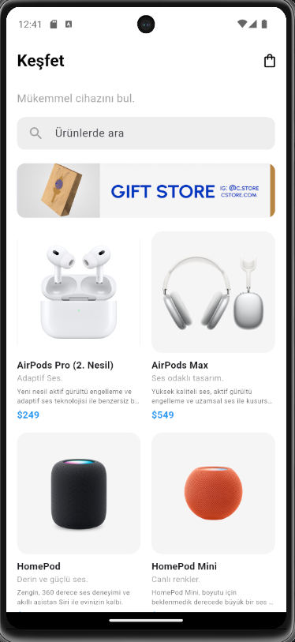
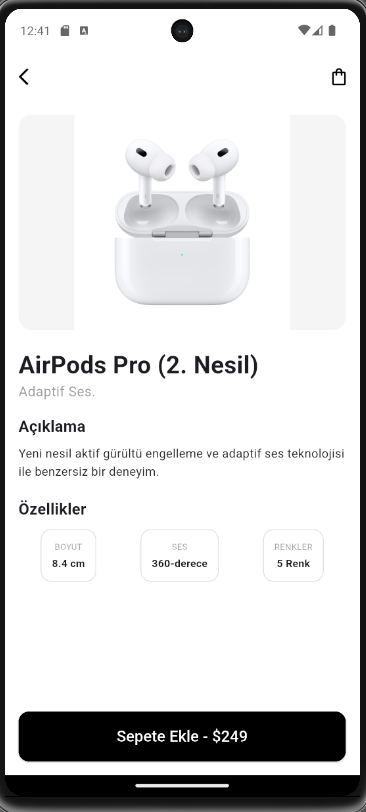

# Mini Katalog Uygulaması 📱

5 Günlük Flutter Eğitim Kampı kapsamında geliştirilmiş, modern arayüzlü ve dinamik özelliklere sahip bir mobil e-ticaret katalog uygulamasıdır.

## 📝 Proje Açıklaması
Bu uygulama, bir e-ticaret platformunun temel akışını (Ürün keşfetme, detay inceleme, arama ve sepet yönetimi) simüle etmek amacıyla geliştirilmiştir. Projede temiz kod yazımı, widget parçalama ve durum yönetimi (State Management) prensipleri uygulanmıştır.

### Öne Çıkan Özellikler:
* **Keşfet Ekranı:** Ürünlerin grid yapısında sergilenmesi.
* **Anlık Arama:** Ürün listesi üzerinde harf duyarlı canlı filtreleme.
* **Ürün Detayları:** Dinamik veri taşıma ile detaylı açıklama ve özellik sayfası.
* **Sepet Yönetimi:** Sepete ürün ekleme, silme ve sepeti boşaltma işlemleri.

## ⚙️ Kullanılan Sürümler
* **Flutter:** 3.x.x 
* **Dart:** 3.x.x

## 📸 Uygulama Ekran Görüntüleri
Aşağıdaki tabloda uygulamanın temel işlevlerine ait ekran görüntüleri yer almaktadır:

| Ana Sayfa (Keşfet) | Ürün Detay Sayfası | Sepetim Ekranı |
|:---:|:---:|:---:|
|  |  |  |

## 🚀 Çalıştırma Adımları
Projeyi yerel ortamınızda, özellikle **Android Emülatör** üzerinde çalıştırmak için aşağıdaki adımları izleyin:

1. **Repository'i Klonlayın:**
   `git clone https://github.com/bnymkrn/mini-katalog-app.git`

2. **Proje Klasörüne Girin:**
   `cd mini_katalog_app`

3. **Bağımlılıkları ve Paketleri Yükleyin:**
   `flutter pub get`

4. **Android Emülatör Seçimi:**
   * VS Code kullanıyorsanız, sağ alt köşede bulunan cihaz menüsüne (Device Selector) tıklayın.
   * Listeden aktif **Android sanal cihazınızı** (Örn: Pixel 7 API 33) seçin.

5. **Uygulamayı Başlatma:**
   * **Yöntem A:** VS Code sol menüsünden **"Run and Debug"** sekmesine gelip mavi renkli "Run" butonuna basın.
   * **Yöntem B:** Klavyenizden doğrudan **F5** tuşuna basarak hata ayıklama modunda başlatın.
   * **Yöntem C:** Terminale `flutter run` komutunu yazın.

---
**Geliştirici:** [Bünyamin Karan](https://github.com/bnymkrn)
